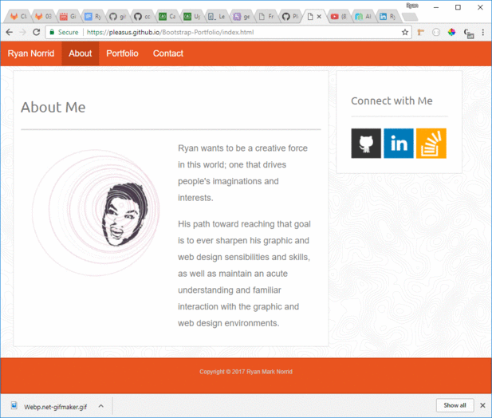

# Bootstrap-Portfolio

Ryan's simple portfolio using Bootstrap for styling.

This site uses bootstrap for its header, footer, and navigation. There is a seperate css file that styles the color of the elements, the image sizes, the background image, the side bar position, and the various text properties.

Use:
1. Go to: https://pleasus.github.io/Bootstrap-Portfolio/
2. Click around.

Process GIF:
